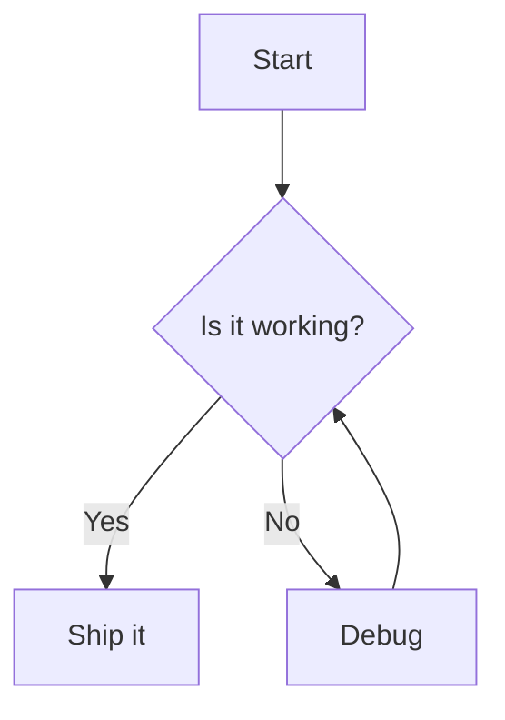

# Markdown Formatting Test Suite

This file exercises a broad range of Markdown syntax for testing a renderer.

## 1. Headings

# H1 Heading
## H2 Heading
### H3 Heading
#### H4 Heading
##### H5 Heading
###### H6 Heading

## 2. Text Emphasis

Plain text.

*Italic with asterisks*
_Italic with underscores_

**Bold with asterisks**
__Bold with underscores__

***Bold and italic***
**_Also bold and italic_**

~~Strikethrough~~

Combining **bold, _nested italic_, and back to bold**.

Highlighted: ==marked text== (if supported)

`Inline code` mixed with **bold** and *italic* and a [link](https://example.com).

## 3. Paragraphs and Line Breaks

This is a paragraph with a soft line break at the end (two trailing spaces).  
This line should appear right after the previous one.

This is a new paragraph, separated by a blank line.

This line ends with a backslash for a hard break.\
This should be on its own line too.

## 4. Blockquotes

> A simple blockquote.

> A blockquote
> spanning multiple lines
> in a single block.

> Level 1 blockquote
>> Level 2 nested blockquote
>>> Level 3 nested blockquote

> A blockquote containing **bold**, *italic*, and `code`.
>
> With a second paragraph inside it.
>
> - and a list
> - inside the quote

## 5. Lists

### 5.1 Unordered Lists

- Item one
- Item two
- Item three
  - Nested item 3.1
  - Nested item 3.2
    - Deeply nested item 3.2.1
- Item four

* Alternate bullet with asterisk
+ Alternate bullet with plus

### 5.2 Ordered Lists

1. First item
2. Second item
3. Third item
   1. Nested first
   2. Nested second
4. Fourth item

1. Item using auto-numbering
1. Item using auto-numbering
1. Item using auto-numbering

### 5.3 Task Lists

- [x] Completed task
- [x] Another completed task
- [ ] Incomplete task
- [ ] Another incomplete task
  - [x] Nested completed subtask
  - [ ] Nested incomplete subtask

### 5.4 Mixed / Loose Lists

- Item with a paragraph continuation.

  This paragraph belongs to the list item above.

- Item with a code block inside.

```js
  console.log("inside a list item");
```

- Item with a blockquote inside.

  > Quoted text inside a list item.

## 6. Code

### 6.1 Inline Code

Use the `useState` hook to manage state, and call `array.map()` for transforms.

### 6.2 Fenced Code Blocks

```
Plain fenced code block with no language.
No syntax highlighting expected.
```

```js
// JavaScript
function greet(name) {
  const message = `Hello, ${name}!`;
  console.log(message);
  return message;
}
greet("World");
```

```python
# Python
def greet(name: str) -> str:
    message = f"Hello, {name}!"
    print(message)
    return message

greet("World")
```

```json
{
  "name": "markdown-test",
  "version": "1.0.0",
  "flags": [true, false, null],
  "count": 42
}
```

```bash
#!/usr/bin/env bash
echo "Running tests..."
for i in 1 2 3; do
  echo "Iteration $i"
done
```

```html
<!doctype html>
<html>
  <body>
    <h1>Hello</h1>
  </body>
</html>
```

```css
.container {
  display: flex;
  justify-content: center;
  color: #333;
}
```

```yaml
name: test
on: [push]
jobs:
  build:
    runs-on: ubuntu-latest
```

```sql
SELECT id, name
FROM users
WHERE active = TRUE
ORDER BY created_at DESC;
```

### 6.3 Indented Code Block

    This is an indented code block.
    It uses four leading spaces instead of fences.
    def old_style():
        return True

## 7. Links

[Inline link](https://www.anthropic.com)

[Inline link with title](https://www.anthropic.com "Anthropic homepage")

[Reference-style link][ref-link]

[Another reference link][1]

Autolink: <https://www.anthropic.com>

Bare URL: https://www.anthropic.com

Email autolink: <someone@example.com>

Relative link: [Go to section 3](#3-paragraphs-and-line-breaks)

[ref-link]: https://www.anthropic.com/claude "Claude by Anthropic"
[1]: https://docs.claude.com "Claude Docs"

## 8. Images


![Reference-style image][img-ref]

[img-ref]: https://placehold.co/200x100 "Reference image"

Image inside a link:

[](https://www.anthropic.com)

## 9. Tables

| Feature       | Supported | Notes                  |
|---------------|:---------:|-------------------------|
| Headings      | Yes       | H1 through H6            |
| Lists         | Yes       | Ordered and unordered    |
| Code blocks   | Yes       | Fenced and indented      |
| Tables        | Yes       | This one, for example    |

| Left aligned | Center aligned | Right aligned |
|:-------------|:--------------:|--------------:|
| a            | b               | c             |
| longer cell  | x               | 123           |
| short        | middle text     | 4,567         |

| Column with `code` | Column with **bold** | Column with [link](https://example.com) |
|---|---|---|
| `npm install` | **important** | see docs |
| plain text | *italic* | ~~struck~~ |

## 10. Horizontal Rules

---

***

___

## 11. Footnotes

Here is a statement that needs a citation.[^1]

Here is another statement with a longer footnote.[^longnote]

[^1]: This is the first footnote.

[^longnote]: This is a longer footnote that might span
    multiple lines when rendered, with continued indentation.

## 12. Definition Lists (extended syntax)

Term 1
: Definition for term 1.

Term 2
: Definition A for term 2.
: Definition B for term 2.

## 13. Escaping and Special Characters

\*Not italic, escaped asterisks\*

\# Not a heading, escaped hash

Literal backtick: \`not code\`

Special characters: & < > " ' © ® ™ § ¶ † ‡ … — –

Math-like symbols: ± × ÷ ≈ ≠ ≤ ≥ ∞ √ ∑ π

Emoji: 🚀 ✅ ❌ 🔥 💡 📌

## 14. HTML Passthrough (if supported)

<div style="padding: 8px; border: 1px solid #ccc;">
  This is a raw HTML block with a <strong>bold</strong> tag and an <em>emphasis</em> tag.
</div>

<details>
<summary>Click to expand</summary>

Hidden content revealed on click, including a nested list:

- Detail item one
- Detail item two

</details>

<mark>Highlighted using raw HTML mark tag</mark>

<kbd>Ctrl</kbd> + <kbd>C</kbd> to copy.

## 15. Math (extended syntax, if supported)

Inline math: $E = mc^2$

Block math:

$$
\int_{a}^{b} f(x)\, dx = F(b) - F(a)
$$

## 16. Mermaid Diagram (extended syntax, if supported)



## 17. Nested Blockquote With Code and List

> ## Quoted heading
>
> A quoted paragraph with `inline code`.
>
> ```js
> console.log("code inside a blockquote");
> ```
>
> 1. Quoted ordered item one
> 2. Quoted ordered item two

## 18. Long Table for Overflow Testing

| ID | Name | Email | Role | Status | Created At | Notes |
|----|------|-------|------|--------|------------|-------|
| 1 | Alice Johnson | alice@example.com | Admin | Active | 2024-01-15 | Initial account |
| 2 | Bob Martinez | bob@example.com | Editor | Active | 2024-02-20 | Handles content |
| 3 | Carol Nguyen | carol@example.com | Viewer | Inactive | 2024-03-05 | Pending review |
| 4 | David Kim | david@example.com | Editor | Active | 2024-04-11 | Multiple team assignments and a long note to test wrapping behavior |

## 19. Edge Cases

Link with parentheses in URL: [Wikipedia article](https://en.wikipedia.org/wiki/Markdown_(disambiguation))

Consecutive emphasis: *italic1* *italic2* **bold1** **bold2**

Nested lists mixing ordered and unordered:

1. Ordered top level
   - Unordered nested
   - Unordered nested
     1. Ordered nested again
2. Ordered top level continued

A very long unbroken string to test wrapping: supercalifragilisticexpialidocioussupercalifragilisticexpialidocioussupercalifragilisticexpialidocious

---

*End of markdown formatting test file.*